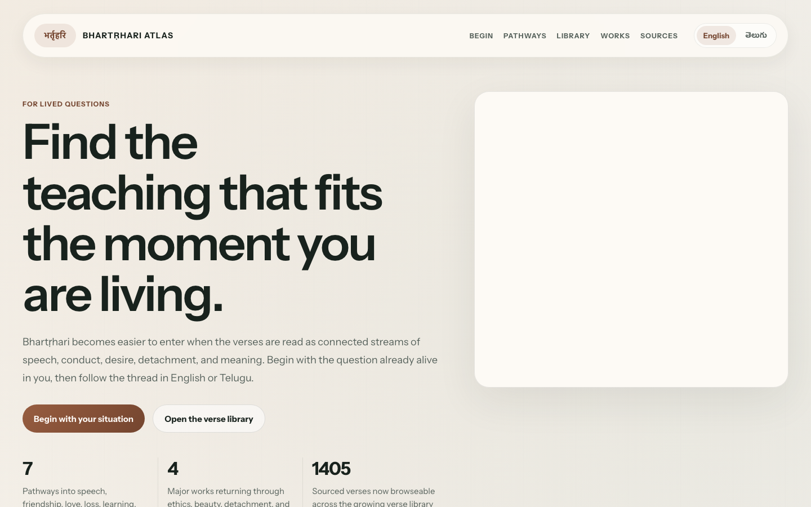

# Bhartṛhari Atlas

A bilingual, reader-first atlas for Bhartṛhari's works.

This project is a static web app that helps readers enter Bhartṛhari through lived situations rather than through disconnected verse lists. It combines a calm editorial UI, source-backed corpus data, and a growing discovery system across ethics, love, detachment, and language.



Live URL:

- [https://bhartrhari-atlas.netlify.app](https://bhartrhari-atlas.netlify.app)

## What this is

Most verse collections preserve the text but not the pathway into it.

This atlas is built for a reader who wants:

- a real-life entry point
- trustworthy source text
- connected reading across works
- English and Telugu support
- a way to move from verse to reflection to practice

Instead of starting from literary taxonomy alone, the app lets the reader begin from a situation such as speech, friendship, longing, detachment, leadership, or meaning.

## Current scope

The library currently includes:

- `Nīti Śataka`: full corpus
- `Śṛṅgāra Śataka`: full corpus
- `Vairāgya Śataka`: full corpus
- `Vākyapadīya`: structured corpus from the GRETIL Rau-based text covering `1.1–3.7`

Current rendering coverage:

- `Nīti Śataka`: full English rendering coverage
- `Śṛṅgāra Śataka`: full English rendering coverage
- `Vairāgya Śataka`: full English rendering coverage
- `Vākyapadīya`: curated English rendering coverage across the main sections, with the full source library available for the complete text

The interface is bilingual at the UI layer, with growing Telugu rendering coverage for selected high-signal verses and kārikās.

## Product direction

Primary user:

- a reader who wants Bhartṛhari to become usable wisdom, not just admired quotation

Job to be done:

- begin from a living question
- find the right verse or kārikā
- understand it in context
- carry one clearer judgment, reflection, or practice back into life

Problem being solved:

- traditional collections often feel fragmented
- sequence and application are usually hidden
- trust is weakened when sources and interpretation are mixed together

## Experience layers

The app currently brings together:

- `Pathways`: situation-first entry into the works
- `Library`: browseable source-backed corpus
- `Cross-work discovery`: movement between related passages across works
- `Trust layer`: explicit source links and edition notes
- `Editorial layer`: renderings, reflections, and guided reading

## Tech stack

This is intentionally simple:

- `HTML`
- `CSS`
- `Vanilla JavaScript`
- generated frontend data files

There is no backend and no database.

The source of truth lives in `data/`, and browser-facing data files are generated from it.

## Project structure

Core app files:

- `index.html`: app structure
- `styles.css`: editorial visual system, responsive layout, and reading surfaces
- `app.js`: UI state, rendering, and discovery logic

Source data:

- `data/works/niti/library.json`
- `data/works/niti/renderings.json`
- `data/works/sringara/library.json`
- `data/works/sringara/renderings.json`
- `data/works/vairagya/library.json`
- `data/works/vairagya/renderings.json`
- `data/works/vakya/library.json`
- `data/works/vakya/renderings.json`

Generated browser assets:

- `niti-library.js`
- `niti-renderings.js`
- `sringara-library.js`
- `sringara-renderings.js`
- `vairagya-library.js`
- `vairagya-renderings.js`
- `vakya-library.js`
- `vakya-renderings.js`

Build scripts:

- `scripts/build-niti-library.mjs`
- `scripts/build-sringara-library.mjs`
- `scripts/build-vairagya-library.mjs`
- `scripts/build-vakya-library.mjs`
- `scripts/build-frontend-data.mjs`
- `scripts/build-all-data.mjs`

## Data model

Each work lives under:

- `data/works/<work>/library.json`
- `data/works/<work>/renderings.json`

`library.json` contains:

- `meta`
- `verses`

`renderings.json` contains:

- `gretilId -> editorial rendering`

For bilingual entries, renderings may be either:

- a plain English string
- an object like `{ en, te }`

## Run locally

Serve the site:

```bash
cd BHARTRHARI-ATLAS
python3 -m http.server 9000
```

Then open:

- [http://localhost:9000](http://localhost:9000)

## Rebuild data

Regenerate the browser assets from existing source data:

```bash
/opt/homebrew/bin/node scripts/build-frontend-data.mjs
```

Refetch corpus source data and regenerate everything:

```bash
/opt/homebrew/bin/node scripts/build-all-data.mjs
```

## Trust and sourcing

This project tries to keep three layers distinct:

- `canonical text`: source-backed corpus data
- `editorial rendering`: readable modern explanation or translation-like support
- `guided reflection`: pathway, context, and practice layers

Important note:

- edition counts and numbering may differ across recensions
- English and Telugu renderings in the app are editorial unless explicitly tied to a published translation
- `Vākyapadīya` currently uses the GRETIL Rau-based text covering `1.1–3.7`

## Sources currently used

- [Śatakatrayī on Wikisource](https://sa.wikisource.org/wiki/%E0%A4%AD%E0%A4%B0%E0%A5%8D%E0%A4%A4%E0%A5%83%E0%A4%B9%E0%A4%B0%E0%A4%BF%E0%A4%B6%E0%A4%A4%E0%A4%95%E0%A4%A4%E0%A5%8D%E0%A4%B0%E0%A4%AF%E0%A5%80)
- [Śatakatraya on GRETIL](https://gretil.sub.uni-goettingen.de/gretil/corpustei/transformations/html/sa_bhatRhari-zatakatraya.htm)
- [Vākyapadīya on GRETIL](https://gretil.sub.uni-goettingen.de/gretil/1_sanskr/6_sastra/1_gram/vakyp_pu.htm)
- [Two Centuries of Bhartrihari](https://archive.org/details/twocenturiesofbh00bhar)
- [Vairagya Satakam scan](https://archive.org/details/vairagyasatakamo025367mbp)

## Status

This is already a functioning public-facing prototype, but it is still growing in three directions:

- selective expansion of `Vākyapadīya` renderings only where a main section needs more continuity
- broader Telugu coverage
- stronger cross-work discovery and verse-level trust notes

## Credit

Prepared by [Shweta Narendernath](https://shwetanarendernath.com) in collaboration with AI coding agents.
